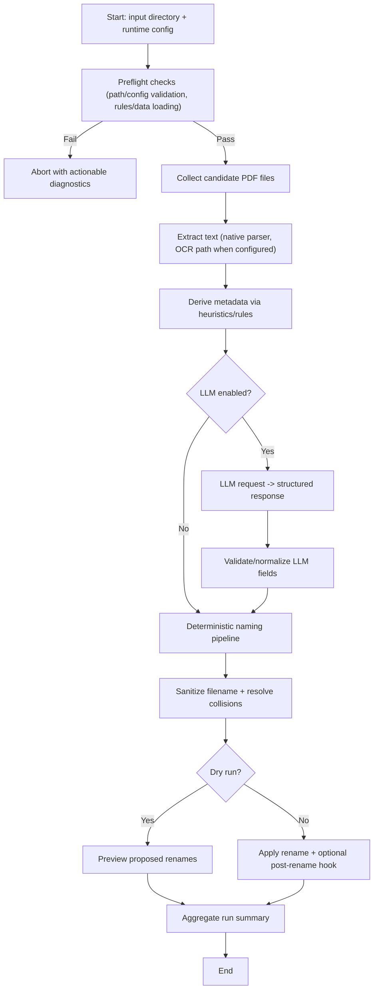
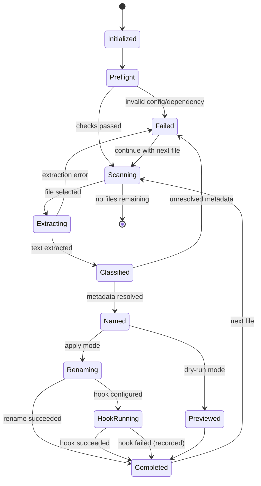

# AI-PDF-Renamer

Local-first tool to rename PDF files by content.

It extracts text, applies heuristic category scoring with optional local-LLM enrichment, and produces deterministic names like:

```text
YYYYMMDD-category-keywords-summary.pdf
```

## What it does

- Renames PDFs from extracted document content.
- Uses heuristics first and optional LLM for enrichment.
- Single-call LLM mode: summary, keywords, and category in one request.
- Vision fallback and vision-first modes for scanned/low-text PDFs.
- LLM hardware presets for Apple Silicon and dedicated GPU setups.
- Supports dry-run, plan export, metadata export, and undo.
- Supports OCR and optional vision fallback for scanned/low-text PDFs.
- Runs as CLI and TUI (Textual).

## Installation

```bash
python -m venv .venv
source .venv/bin/activate
python -m pip install -U pip
python -m pip install -e '.[dev,pdf]'
```

Optional extras:

```bash
# TUI (terminal UI)
python -m pip install -e '.[tui]'

# In-process LLM via llama-cpp-python
python -m pip install -e '.[llama-cpp]'

# Tokenization, OCR, embeddings
python -m pip install -e '.[tokens,ocr,embeddings]'
```

## Quick start

Run once against a directory (uses `apple-silicon` preset by default — Qwen 2.5 3B via Ollama):

```bash
ai-pdf-renamer --dir ./input_files --dry-run
```

If you have a dedicated GPU (e.g. RTX 4080 Super 16 GB), use the `gpu` preset for the larger model:

```bash
ai-pdf-renamer --dir ./input_files --llm-preset gpu --dry-run
```

For scanned PDFs with vision-first extraction:

```bash
ai-pdf-renamer --dir ./input_files --preset scanned --dry-run
```

Apply changes:

```bash
ai-pdf-renamer --dir ./input_files
```

Preflight diagnostics:

```bash
ai-pdf-renamer --doctor
```

TUI:

```bash
ai-pdf-renamer-tui
```

Undo preview from rename log:

```bash
ai-pdf-renamer-undo --rename-log rename.log --dry-run
```

### LLM hardware presets

| Preset | Model | Size (Q4) | Context | Target hardware |
|--------|-------|-----------|---------|-----------------|
| `apple-silicon` (default) | `qwen2.5:3b` | ~2 GB | 32K | Apple Silicon M4 16 GB |
| `gpu` | `qwen2.5:7b-instruct` | ~4.5 GB | 128K | RTX 4080 Super 16 GB |

Both presets use Ollama (`http://127.0.0.1:11434`). Explicit `--llm-model`, `--llm-url`, or `--max-content-chars` override preset values.

## How it works


```mermaid
flowchart TD
A["Start: input directory + runtime config"] --> B["Preflight checks (path/config validation, rules/data loading)"]
B -->|Fail| Z["Abort with actionable diagnostics"]
B -->|Pass| C["Collect candidate PDF files"]
C --> D["Extract text (native parser, OCR path when configured)"]
D --> E["Derive metadata via heuristics/rules"]
E --> F{"LLM enabled?"}
F -->|No| G["Deterministic naming pipeline"]
F -->|Yes| H["LLM request -> structured response"]
H --> I["Validate/normalize LLM fields"]
I --> G
G --> J["Sanitize filename + resolve collisions"]
J --> K{"Dry run?"}
K -->|Yes| L["Preview proposed renames"]
K -->|No| M["Apply rename + optional post-rename hook"]
L --> N["Aggregate run summary"]
M --> N
N --> O["End"]
```

Interpretation: the pipeline always validates preconditions first, then processes each file through extraction and metadata generation. LLM is optional and never required for heuristic-only runs. The final branch is operational (`--dry-run` preview vs actual rename), but both paths produce summary output.

## File lifecycle


```mermaid
stateDiagram-v2
[*] --> Initialized
Initialized --> Preflight
Preflight --> Failed : invalid config/dependency
Preflight --> Scanning : checks passed

Scanning --> Extracting : file selected
Extracting --> Classified : text extracted
Extracting --> Failed : extraction error

Classified --> Named : metadata resolved
Classified --> Failed : unresolved metadata

Named --> Previewed : dry-run mode
Named --> Renaming : apply mode

Renaming --> Completed : rename succeeded
Renaming --> HookRunning : hook configured
HookRunning --> Completed : hook succeeded
HookRunning --> Completed : hook failed (recorded)

Previewed --> Completed
Completed --> Scanning : next file
Failed --> Scanning : continue with next file
Scanning --> [*] : no files remaining
```

Interpretation: failures are contained per file (they are recorded and processing continues), while completion states feed back into scanning until no files remain. Hook failures are non-fatal and counted in summary/log output.

## Configuration model

Precedence is:

1. CLI flags
2. Config file values (`--config` JSON/YAML)
3. Environment defaults (for supported settings)
4. Built-in defaults

Important defaults:

- LLM URL: `http://127.0.0.1:11434/v1/completions` (Ollama, via preset; code default without preset is `http://127.0.0.1:8080/v1/completions`)
- LLM model: `qwen2.5:3b` (apple-silicon preset) / `qwen2.5:7b-instruct` (gpu preset)
- Extraction token default: `28000` (`DEFAULT_MAX_CONTENT_TOKENS`)
- Log file: `error.log`

High-impact operational flags:

- `--post-rename-hook CMD`
- `--summary-json FILE`
- `--doctor`
- `--rules-file FILE`
- `--max-tokens N`, `--max-content-chars N`, `--max-content-tokens N`
- `--workers N`
- `--preset` (`high-confidence-heuristic`, `scanned`)
- `--llm-preset` (`apple-silicon`, `gpu`)
- `--no-single-llm-call`, `--no-chat-api`, `--no-json-mode`

## Environment variables

| Variable | Description |
|----------|-------------|
| `AI_PDF_RENAMER_LLM_BACKEND` | LLM backend: `http`, `in-process`, or `auto` |
| `AI_PDF_RENAMER_LLM_URL` | HTTP endpoint URL |
| `AI_PDF_RENAMER_LLM_MODEL` | Model name for HTTP backend |
| `AI_PDF_RENAMER_LLM_MODEL_PATH` | Path to GGUF model file (in-process backend) |
| `AI_PDF_RENAMER_LLM_TIMEOUT` | LLM request timeout in seconds |
| `AI_PDF_RENAMER_MAX_TOKENS` | PDF extraction token cap |
| `AI_PDF_RENAMER_MAX_CONTENT_CHARS` | Cap chars of text sent to LLM |
| `AI_PDF_RENAMER_MAX_CONTENT_TOKENS` | Cap tokens for LLM (requires tiktoken) |
| `AI_PDF_RENAMER_DATA_DIR` | Override path for bundled JSON data files |
| `AI_PDF_RENAMER_OCR_LANG` | OCR language override |
| `AI_PDF_RENAMER_POST_RENAME_HOOK` | Command run after each successful rename |
| `AI_PDF_RENAMER_LOG_FILE` | Log file path (default: `error.log`) |
| `AI_PDF_RENAMER_LOG_LEVEL` | Log level (default: `INFO`) |
| `AI_PDF_RENAMER_STRUCTURED_LOGS` | Enable structured JSON logging (`1` or `true`) |
| `AI_PDF_RENAMER_USE_VISION_FALLBACK` | Enable vision fallback for low-text PDFs |
| `AI_PDF_RENAMER_VISION_FIRST` | Use vision extraction before text extraction |

## Public API compatibility

Stable interfaces from `ai_pdf_renamer.renamer`:

- `rename_pdfs_in_directory(directory, config, files_override=None)`
- `generate_filename(pdf_content, *, config, llm_client=None, heuristic_scorer=None, stopwords=None, ...)`
- `RenamerConfig`

No intentional signature-breaking changes are made within the current major version.

## Safety and limitations

- Designed for local-first operation and local LLM endpoints.
- Built-in LLM HTTP calls use `trust_env=False` to avoid proxy leakage by default.
- Post-rename hooks are operator-controlled and run with current user privileges.
- Best safety is single-process operation per target directory.

See [SECURITY.md](SECURITY.md) for security policy and reporting.

## Troubleshooting

- Run `ai-pdf-renamer --doctor` for dependency/data/LLM diagnostics.
- If LLM endpoint is unavailable, retry with `--no-llm`.
- For scanned PDFs, install OCR deps and use `--ocr` or `--preset scanned`.
- For strict local validation, run `make release-check`.

## Documentation

- [CONTRIBUTING.md](CONTRIBUTING.md)
- [SECURITY.md](SECURITY.md)
- [CHANGELOG.md](CHANGELOG.md)

## License

MIT — see [LICENSE](LICENSE).
