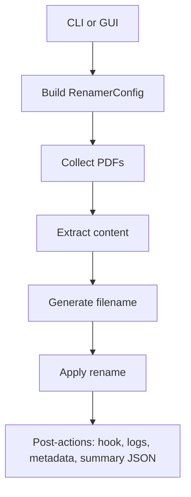

# Architecture – AI-PDF-Renamer

Top-level architecture, runtime flow, and stable interfaces.

## Domain

Single-process, local-first PDF batch renaming.

- Input: PDFs in a directory (or selected single file).
- Processing: extraction -> categorization -> filename generation.
- Output: rename in place (or dry-run/plan/export).

## Stable Public Interfaces

From `ai_pdf_renamer.renamer`:

- `rename_pdfs_in_directory(directory, config, files_override=None)`
- `generate_filename(pdf_content, *, config, llm_client=None, heuristic_scorer=None, stopwords=None, ...)`
- `RenamerConfig`

These are compatibility-sensitive interfaces.

## Runtime Flow

```mermaid
flowchart TB
  A[CLI or GUI] --> B[Build RenamerConfig]
  B --> C[Collect PDFs]
  C --> D[Extract content]
  D --> E[Generate filename]
  E --> F[Apply rename]
  F --> G[Post-actions: hook, logs, metadata, summary JSON]
```

## Module Responsibilities

- `cli_parser.py`: argument parser and flags.
- `cli.py`: input resolution, config assembly, doctor mode, execution.
- `config.py`: `RenamerConfig` dataclass.
- `config_resolver.py`: shared normalization for CLI and GUI values.
- `gui.py`: Tkinter desktop interface.
- `renamer.py`: orchestration facade and compatibility wrappers.
- `renamer_files.py`: file collection and include/exclude filtering.
- `renamer_extract.py`: extraction + OCR + optional vision fallback.
- `filename.py`: category/summary/keyword pipeline and filename construction.
- `heuristics.py`: rule loading/scoring and heuristic-vs-LLM category resolution.
- `llm.py`, `llm_parsing.py`, `llm_prompts.py`, `llm_schema.py`: LLM calls, parsing, prompts, schema validation.
- `rename_ops.py`: sanitization and atomic-ish rename operations.
- `rules.py`: optional processing-rules file behavior.
- `data_paths.py`: safe data file resolution.

## Data Files

Shipped package data (`src/ai_pdf_renamer/data/`):

- `heuristic_scores.json`
- `meta_stopwords.json`
- `category_aliases.json`
- `llm_response_schema.json`

Overridable with `AI_PDF_RENAMER_DATA_DIR`.

## Boundaries and Safety

- Local filesystem operations only.
- Optional local HTTP to LLM endpoint.
- LLM requests use proxy-disabled session (`trust_env=False`).
- Filename/path sanitization centralized in `rename_ops.py` and `text_utils.py`.
- Rules/data parse and validation happen at boundaries.

## Operational Outputs

- Rename log (`--rename-log`)
- Metadata export (`--export-metadata`)
- Run summary JSON (`--summary-json`)
- Plan file (`--plan-file`)

## References

- [README.md](../README.md)
- [RUNBOOK.md](RUNBOOK.md)
- [PRD.md](product-specs/PRD.md)
- [BUGS_AND_FIXES.md](../BUGS_AND_FIXES.md)
- [SECURITY.md](../SECURITY.md)
